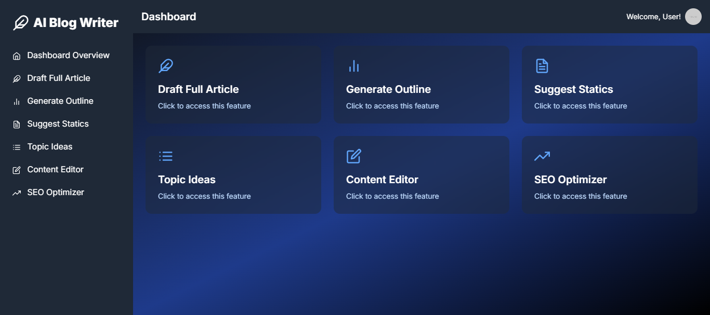

# AI Blog Writer

## 🚧 Under Development 🚧

This project is currently in active development. Features may be incomplete or subject to change.

## Description

AI Blog Writer is an innovative tool designed to streamline the content creation process for professional and educational blogging. Leveraging the power of artificial intelligence, this application helps users generate outlines, suggest relevant statistics, and draft full articles based on given topics or keywords.


User Dashboard



## Features

- **Article Generation**: Create full-length articles on any given topic.
- **Customizable Content**: Tailor your content with options for:
  - Article Type (Informative, Persuasive, How-To Guide, Listicle, Comparison)
  - Target Audience (General, Professional, Academic, Technical)
  - Word Count
  - Tone (Neutral, Formal, Casual, Optimistic, Critical)
- **Markdown Support**: Generated articles are formatted in Markdown for easy editing and publishing.
- **Syntax Highlighting**: Code snippets within articles are automatically syntax-highlighted.
- **Copy to Clipboard**: Easily copy the generated article with a single click.
- **Responsive Design**: Seamless experience across desktop and mobile devices.

## Technology Stack

- Next.js 14
- React
- TypeScript
- Tailwind CSS
- React Markdown
- React Syntax Highlighter

## Setup and Installation

1. Clone the repository:
   ```
   git clone https://github.com/RaheesAhmed/blog-content-writer-saas.git
   ```

2. Navigate to the project directory:
   ```
   cd blog-content-writer-saas
   ```

3. Install dependencies:
   ```
   npm install
   ```

   rename the  `.env.local` to `.env`  and add following:

   ```
   OPENAI_API_KEY=add your openai api key here
   ```

4. Run the development server:
   ```
   npm run dev
   ```

5. Open [http://localhost:3000](http://localhost:3000) in your browser to see the application.

## Usage

1. Navigate to the "Draft Full Article" page.
2. Enter your article topic in the input field.
3. Select the article type and target audience from the dropdown menus.
4. (Optional) Adjust advanced settings like word count and tone.
5. Click "Generate Article" and wait for the AI to create your content.
6. The generated article will appear in the right panel, formatted in Markdown.
7. Use the copy button to easily copy the entire article to your clipboard.

## API Integration

The application is designed to work with a custom API endpoint for article generation. Ensure your API is set up and running at `http://localhost:3000/api/blog/write`.

## Contributing

As this project is under development, contributions are welcome. Please feel free to submit pull requests or create issues for bugs and feature requests.

## License

[MIT License](LICENSE)

## Contact

For any queries or suggestions, please open an issue in this repository.
